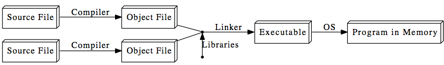

# Lecture 1 Notes: Introduction

__Faisal Qureshi__  
faisal.qureshi@uoit.ca

_Please see credits below._

## Compiled Languages and C++ 

### Why Use a Language Like C++?

At its core, a computer is just a processor with some memory, capable of running tiny instructions like “store 5 in memory location 23459.” Why would we express a program as a text file in a programming language, instead of writing processor instructions?

The advantages:

- __Conciseness__: programming languages allow us to express common sequences of com­ mands more concisely. C++ provides some especially powerful shorthands.
- __Maintainability__: modifying code is easier when it entails just a few text edits, instead of rearranging hundreds of processor instructions. C++ is object oriented (more on that in Lectures 7-8), which further improves maintainability.
- __Portability__: different processors make different instructions available. Programs writ­ ten as text can be translated into instructions for many different processors; one of C++’s strengths is that it can be used to write programs for nearly any processor.
C++ is a high-level language: when you write a program in it, the shorthands are sufficiently expressive that you don’t need to worry about the details of processor instructions. C++ does give access to some lower-level functionality than other languages (e.g. memory addresses).

### The Compilation Process

A program goes from text files (or source files) to processor instructions as follows:

Source File
Source File
Compiler
Compiler
Object File
Object File
Linker OS Executable
Libraries
Program in Memory

Object files are intermediate files that represent an incomplete copy of the program: each source file only expresses a piece of the program, so when it is compiled into an object file, the object file has some markers indicating which missing pieces it depends on. The linker takes those object files and the compiled libraries of predefined code that they rely on, fills in all the gaps, and spits out the final program, which can then be run by the operating system (OS).

The compiler and linker are just regular programs. The step in the compilation process in which the compiler reads the file is called parsing.

In C++, all these steps are performed ahead of time, before you start running a program. In some languages, they are done during the execution process, which takes time. This is one of the reasons C++ code runs far faster than code in many more recent languages.

C++ actually adds an extra step to the compilation process: the code is run through a preprocessor, which applies some modifications to the source code, before being fed to the compiler. Thus, the modified diagram is:

### General Notes on C++

C++ is immensely popular, particularly for applications that require speed and/or access to some low-level features. It was created in 1979 by Bjarne Stroustrup, at first as a set of extensions to the C programming language. C++ extends C; our first few lectures will basically be on the C parts of the language.

Though you can write graphical programs in C++, it is much hairier and less portable than text-based (console) programs. We will be sticking to console programs in this course.

Everything in C++ is case sensitive: `someName` is not the same as SomeName. 

## Hello World

In the tradition of programmers everywhere, we’ll use a “Hello, world!” program as an entry point into the basic features of C++.

###  The code

~~~cpp
1 // A Hello World program 
2 #include <iostream>
3
4 int main() {
5 std::cout << "Hello, world!\n"; 
6
7 return 0;
8 }
~~~

## Tokens

Tokens are the minimals chunk of program that have meaning to the compiler – the smallest meaningful symbols in the language. Our code displays all 6 kinds of tokens, though the usual use of operators is not present here:

Token type | Description/Purpose | Examples
-----------|---------------------|----------
 Keywords | Words with special meaning to the compiler | int, double, for, auto
 Identifiers |  Names of things that are not built into the language | cout, std, x, myFunction
 Literals | Basic constant values whose value is specified directly in the source code |  "Hello, world!", 24.3, 0, ’c’
 Operators | Mathematical or logical oper­ations | +, -, &&, %, <<
 Punctuation/Separators | Punctuation defining the structure of a program | {}(),;
 Whitespace | Spaces of various sorts; ig­ nored by the compiler | Spaces, tabs, newlines, com­ments
        
## Line-By-Line Explanation

1. `//` indicates that everything following it until the end of the line is a comment: it is ignored by the compiler. Another way to write a comment is to put it between `/*` and `*/` (e.g. `x = 1 + /*sneaky comment here*/ 1;`). A comment of this form may span multiple lines. Comments exist to explain non-obvious things going on in the code. Use them: document your code well!
- Lines beginning with `#` are preprocessor commands, which usually change what code is actually being compiled. `#include` tells the preprocessor to dump in the contents of another file, here the iostream file, which defines the procedures for input/output.
- `int main() {...}` defines the code that should execute when the program starts up. The curly braces represent grouping of multiple commands into a block. More about this syntax in the next few lectures.
- `cout <<` : This is the syntax for outputting some piece of text to the screen. We’ll discuss how it works in the lecture.
- Namespaces: In C++, identifiers can be defined within a context – sort of a directory of names – called a namespace. When we want to access an identifier defined in a namespace, we tell the compiler to look for it in that namespace using the scope resolution operator (`::`). Here, we’re telling the compiler to look for `cout` in the `std` namespace, in which many standard C++ identifiers are defined. A cleaner alternative is to add `using namespace std;` below line 2.  This line tells the compiler that it should look in the std namespace for any identifier we haven’t defined. If we do this, we can omit the `std::` prefix when writing cout. This is the recommended practice.
- Strings: A sequence of characters such as Hello, world is known as a string. A string that is specified explicitly in a program is a string literal.
- Escape sequences: The `\n` indicates a newline character. It is an example of an escape sequence – a symbol used to represent a special character in a text literal. Here are all the C++ escape sequences which you can include in strings:
   
   Escape Sequence | Represented Character
   ----------------|-----------------------
  `\a` | System bell (beep sound)
  `\b` | Backspace
  `\f` | Formfeed (page break)
  `\n` | Newline (line break)
  `\r` | “Carriage return” (returns cursor to start of line)
  `\t` | Tab
  `\\` | Backslash
  `\’` | Single quote character
  `\"` | Double quote character
  `\some integer x`, `\67` |  The character represented by x
  
8. `return 0` indicates that the program should tell the operating system it has completed successfully. This syntax will be explained in the context of functions; for now, just include it as the last line in the main block.
9. Note that every statement ends with a semicolon (except preprocessor commands and blocks using `{}`). Forgetting these semicolons is a common mistake among new C++ programmers.

##  Basic Language Features
So far our program doesn’t do very much. Let’s tweak it in various ways to demonstrate some more interesting constructs.

###  Values and Statements
First, a few definitions:

- A statement is a unit of code that does something – a basic building block of a program.
- An expression is a statement that has a value – for instance, a number, a string, the sum of two numbers, etc. `4 + 2`, `x - 1`, and `"Hello, world!\n"` are all expressions.

Not every statement is an expression. It makes no sense to talk about the value of an #include statement, for instance.

### Operators

We can perform arithmetic calculations with operators. Operators act on expressions to form a new expression. For example, we could replace `"Hello, world!\n"` with `(4 + 2) / 3`, which would cause the program to print the number 2. In this case, the `+` operator acts on the expressions 4 and 2 (its operands).

Operator types:

- Mathematical: `+`, `-`, `*`, `/`, and parentheses have their usual mathematical meanings, including using `-` for negation. `%` (the modulus operator) takes the remainder of two numbers: `6 % 5` evaluates to `1`.
-  Logical: used for “and,” “or,” and so on. More on those in the next lecture.
-  Bitwise: used to manipulate the binary representations of numbers. More on these later.

### Data Types

Every expression has a type – a formal description of what kind of data its value is. For instance, 0 is an integer, 3.142 is a floating-point (decimal) number, and `"Hello, world!\n"` is a string value (a sequence of characters). Data of different types take a different amounts of memory to store. Here are the built-in datatypes we will use most often:
   
   Type Names | Description | Size | Range
   -----------|-------------|------|------
  char | Single text character or small integer. Indicated with single quotes (’a’, ’3’). | 1 byte | signed: -128 to 127 unsigned: 0 to 255
  int | Larger integer. | 4 bytes | signed: -2147483648 to 2147483647 unsigned: 0 to 4294967295
  bool | Boolean (true/false). Indi­cated with the keywords true and false. | 1 byte | Just true (1) or false (0).
  double | “Doubly” precise floating point number. | 8 bytes | +/- 1.7e +/- 308 ( 15 digits)
      
Notes on this table:
      
- A signed integer is one that can represent a negative number; an unsigned integer will never be interpreted as negative, so it can represent a wider range of positive numbers. Most compilers assume signed if unspecified.
- There are actually 3 integer types: short, int, and long, in non-decreasing order of size (int is usually a synonym for one of the other two). You generally don’t need to worry about which kind to use unless you’re worried about memory usage or you’re using really huge numbers. The same goes for the 3 floating point types, float, double, and long double, which are in non-decreasing order of precision (there is usually some imprecision in representing real numbers on a computer).
- The sizes/ranges for each type are not fully standardized; those shown above are the ones used on most 32-bit computers.

An operation can only be performed on compatible types. You can add 34 and 3, but you can’t take the remainder of an integer and a floating-point number.

An operator also normally produces a value of the same type as its operands; thus, 1 / 4 evaluates to 0 because with two integer operands, / truncates the result to an integer. To get 0.25, you’d need to write something like 1 / 4.0.

A text string, for reasons we will learn in Lecture 5, has the type char *.

### Variables

We might want to give a value a name so we can refer to it later. We do this using variables. A variable is a named location in memory.

For example, say we wanted to use the value 4 + 2 multiple times. We might call it x and use it as follows:

~~~cpp
1 #include <iostream> 
2 using namespace std;
3
4 int main() { 
5 int x;
6 x=4+2; 
7 cout << x/3 << ’’ << x*2;
8 return 0; 
9 }
~~~

(Note how we can print a sequence of values by “chaining” the << symbol.)

The name of a variable is an identifier token. Identifiers may contain numbers, letters, and
underscores (_), and may not start with a number.

Line 5 is the declaration of the variable x. We must tell the compiler what type x will be so that it knows how much memory to reserve for it and what kinds of operations may be performed on it.

Line 6 is the initialization of x, where we specify an initial value for it. This introduces a new operator: =, the assignment operator. We can also change the value of x later on in the code using this operator.

We could replace lines 5 and 6 with a single statement that does both declaration and initialization:
int x = 4 + 2;

This form of declaration/initialization is cleaner, so it is to be preferred.

### Input

Now that we know how to give names to values, we can have the user of the program input values. This is demonstrated in line 6 below:

~~~cpp
1 #include <iostream> 
2 using namespace std;
3
4 int main() { 
5 int x;
6 cin >> x;
7 cout << x/3 << ’’ << x*2;
8 return 0; 
9 }
~~~

Just as `cout <<` is the syntax for outputting values, `cin >>` (line 6) is the syntax for inputting values.

Memory trick: if you have trouble remembering which way the angle brackets go for cout and cin, think of them as arrows pointing in the direction of data flow. cin represents the terminal, with data flowing from it to your variables; cout likewise represents the terminal, and your data flows to it.

### Debugging

There are two kinds of errors you’ll run into when writing C++ programs: compilation errors and runtime errors. Compilation errors are problems raised by the compiler, generally resulting from violations of the syntax rules or misuse of types. These are often caused by typos and the like. Runtime errors are problems that you only spot when you run the program: you did specify a legal program, but it doesn’t do what you wanted it to. These are usually more tricky to catch, since the compiler won’t tell you about them.

## Credits

These notes are taken from MIT OpenCourseWare, 6.096 Introduction to C++ January (IAP) 2011 under the terms listed [http://ocw.mit.edu/terms](https://creativecommons.org/licenses/by-nc-sa/4.0/legalcode).  You are free to __share__ and __adapt__ these materials under the [Creative Commons License](https://creativecommons.org/licenses/by-nc-sa/4.0/legalcode).

