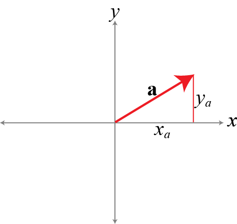

# CSCI 1061U - Programming Workshop

## Goal: Vec2 Class

Our goal is to create a `vec2` class that can be used to store the information of a 2-dimensional (2D) 0vector.  As seen in the figure below, each 2D vectors has two components: $x$ and $y$.

## Implementation

See the `vec2.h` that defines the vector class.  

~~~cpp
#include <iostream>

class vec2 {
public:
  double x;
  double y;

public:

  // Constructors
  vec2();
  vec2(double c);
  vec2(double x, double y);
  vec2(const vec2& o); // Copy constructor
  
  // Destructor
  ~vec2();
  
public:
  double length();

  // Assignment operator
  vec2& operator=(const vec2& o); 
};
~~~

The corresponding `vec2.cpp` file is

~~~cpp
#include "vec2.h"
#include "math.h"

using namespace std;

vec2::vec2() : x(0.0), y(0.0) // This is called the initializer-list.
                              // We can use it to initialize the member data.
{}

vec2::vec2(double c)
{
  this->x = c;
  this->y = c;
}

vec2::vec2(double x, double y)
{
  this->x = x;
  this->y = y;
}

vec2::vec2(const vec2& o) // The copy constructor.
                          // const keyword indicates that
                          // we are not allowed to modify the 
                          // passed reference, which makes sense
                          // it is unwise to modify o when copying it.
{
  x = o.x;
  y = o.y;
}

vec2::~vec2() // This is called when an instance is destroyed
              // 1. Goes out of scope
              // 2. delete is called (in case of dynamic allocations)
{}

vec2& vec2::operator=(const vec2& o) // The assignment operator.
                                     // const keyword indicates that
                                     // we are not allowed to modify the 
                                     // passed reference, which makes sense
                                     // it is unwise to modify o when copying it.
{
  x = o.x;
  y = o.y;
  return *this;     // this is a pointer that points to this instance of vec2.
                    // here, we are return a reference, so we need an object.
                    // we use the de-reference operator * to do so.
}

double vec2::length()
{
  return sqrt(x*x + y*y);
}
~~~

`main.cpp` file below uses this 2D vectors.

~~~cpp
#include <iostream>
#include "vec2.h"

using namespace std;

int main()
{
  vec2 a;
  a.x = 1.5;
  a.y = 2.7;

  vec2 b(2.4, 54.4);
  //cout << "length of b = " << b.length() << endl;
  
  cout << "a = (" << a.x << "," << a.y << ")" << endl; 
  cout << "b = (" << b.x << "," << b.y << ")" << endl; 

  vec2* c = new vec2(9.9999);
  cout << "c = (" << c->x << "," << c->y << ")" << endl; 
  delete c;

  b = a; // Using the assignemnt operator
  cout << "b = (" << b.x << "," << b.y << ")" << endl; 
  
  return 0;
}
~~~

## Compilation

We can compile the above code as follows

~~~bash
$ g++ main.cpp vec2.cpp -o vec2
~~~